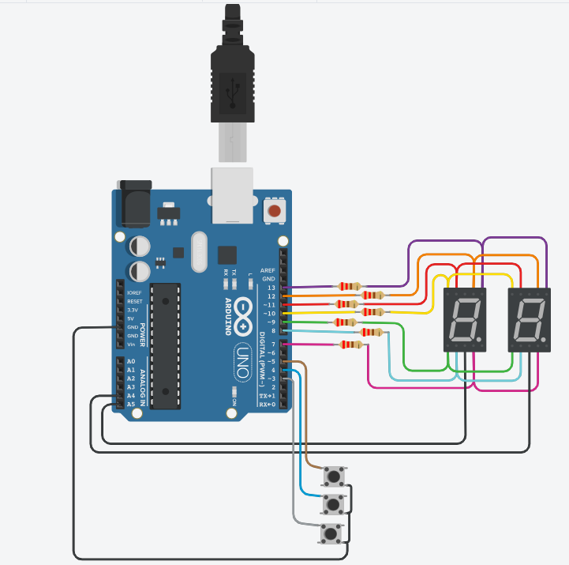

# Trabajo grupal TinkerCad 

## Integrantes 
- Pedro Serra
- Nicolas Sanchez 
- Mateo Roberto

## Proyecto: Multiplexación.

## Descripción
Consta de una placa de Arduino, de la cual se desprenden diversos cables que otorgan funcionamiento a través de una diferencia de potencial a 2 display de 7 segmentos y 3 botones. Los tres botones realizan modificaciones en el numero que forman ambos displays.

## Función principal
A traves de los botones del proyecto permite incrementar en 1, reducir en 1 o resetear el número que forman ambos display, este va desde 00 hasta 99. Cada uno de los botones tiene su función de manera independiente. 

En caso que, se incremente en 1 valor el número que se muestra en los display cuando este se encuentra en "99", volvera a "00"; y si se reduce en 1 el valor del display cuando este se encuentre en "00", volvera a "99". Por ultimo, independientemente del número en el que se encuentre, presionando el botón designado para resetear, volvera a "00".

## :robot: Link al proyecto
- [Proyecto](https://www.tinkercad.com/things/34vmM1zva4y-copy-of-stunning-lappi-kieran/editel?sharecode=F42e5XHR80Ocge0p2highHbdIEys9grwlMNyKdWlhOA).

---
### Fuentes
- [Sistemas de Procesamiento de Datos - Clase 4
](https://www.youtube.com/watch?v=_Ry7mtURGDE&t=1755s).
