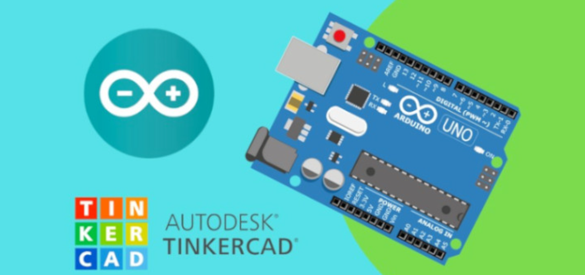
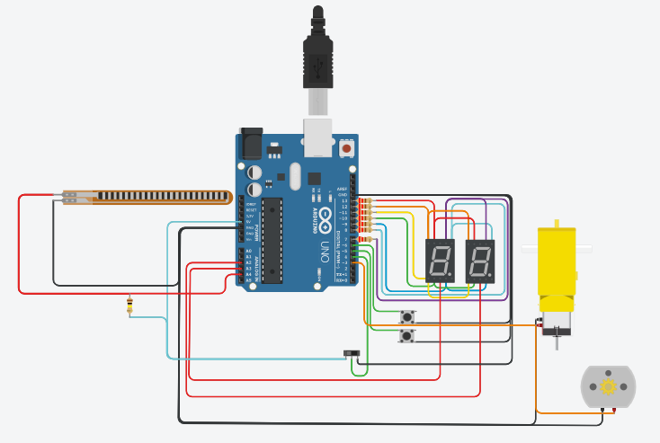

# Trabajo grupal TinkerCad 

## Integrantes 
- Pedro Serra
- Nicolas Sanchez 
- Mateo Roberto

## Proyecto: Arduino parte 2.

## Descripción
Consta de una placa de Arduino, de la cual se desprenden diversos cables que otorgan funcionamiento a través de una diferencia de potencial a 2 display de 7 segmentos, 2 botones, 2 motores, 1 sensor y 1 interruptor . Los 2 botones realizan modificaciones en el numero que forman ambos displays.

## Función principal
A traves de los botones del proyecto permite incrementar o resetear el número que forman ambos display, este va desde 00 hasta 99. Cada uno de los botones tiene su función de manera independiente. 

A su vez, se agregaron los siguientes dispositivos al proyecto:

1 - Interruptor deslizante: 
Consta de un dispositivo el cual permite dejarlo de forma activa o inactiva a través de un interruptor. Va conectado a 5V, tierra y un pin de la placa de Arduino.

De la forma que se implemento este dispositivo en nuestro proyecto es que cuando se encuentra de forma activa, solo va a mostrar números primos en los display, en el caso que se pulse el botón para incrementar, pasara al proximo número primo y en el caso de preisonar el botón para presionar volvera a 2 (no puede volver a 0 por que no es un número primo, automaticamanete pasa al siguiente despues del 0).

2 - Motor CC: 
Es un dispositivo, el cual permite que a partir de la energía que se genera en la placa de Arduino, convertirla en movimiento rotativo del motor de este. Su velocidad se mide en RPM (Revoluciones por minuto).

De la forma que se implemento en nustro proyecto es que a medida que aumente el contador, aumentara también las RPM que genera el dispositivo.

3 - Motor de aficionado:
Es similar al motor cc, tiene dos terminales, uno positivo y otro negativo, cuando a este se le aplica un voltaje gira hacia un lado y la velocidad también se mide en RPM. Sin embargo, si se aplica un voltaje pero, los cables estan conectados al revez, el motor empezaría a girar hacia el lado contrario. Puede ir conectado a la placa de Arduino a través de dos pines. 

En nuestro proyecto se utilizo para que vayan aumentando las RPM mientras aumenta el contador. 

A tener presente que este aumenta en menor medida a lo que hace el Motor CC por que tiene un reductor que se encarga de que gire más lento pero con mayor fuerza. 

Esto se logra ya que, con la función analogWrite(), pasamos como parametro el pin asignado con el motor y el contador en nuestro proyecto.

4 - Sensor de flexión:
Se trata de un dispositivo que mide el grado de flexión que se aplica sobre el mismo. Cuando el dispositivo se encuentra todo estirado el grado de flexión es de 0, y cuando se encuentra flexionado a su limite maximo es de 180.

Para determinar el grado de flexión, se realiza con la función map(), en donde se le tiene que pasar como parametro la SEÑAL (la lectura que se hace del dispositivo), el VALOR MINIMO DE LECTURA, el VALOR MAXIMO DE LECTURA DEL LECTOR, MAGNITUD FISICA MINIMA, MAGNITUD FISICA MÁXIMA)

De la forma que se integro este nuevo dispositivo en nuestro proyecto, es como una validación extra a la condición del swtich para pasar de numeros primos a numeros no primos y viceversa. 

Por ejemplo:
Si estas con el switch hacia la derecha, en donde se pueden sumar con el pulsador de a numeros NO primos, y quieres correr el switch para que se empieze a sumar de a numeros primos (switch hacia la izquierda), no lo permitira hasta que se aplique una flexión de 180° al sensor de flexión. 

## :robot: Link al proyecto
- [Proyecto](https://www.tinkercad.com/things/dDXRQc7dzjw)

---
### Fuentes
- [Sistemas de Procesamiento de Datos - Clase 4
](https://www.youtube.com/watch?v=_Ry7mtURGDE&t=1755s).
